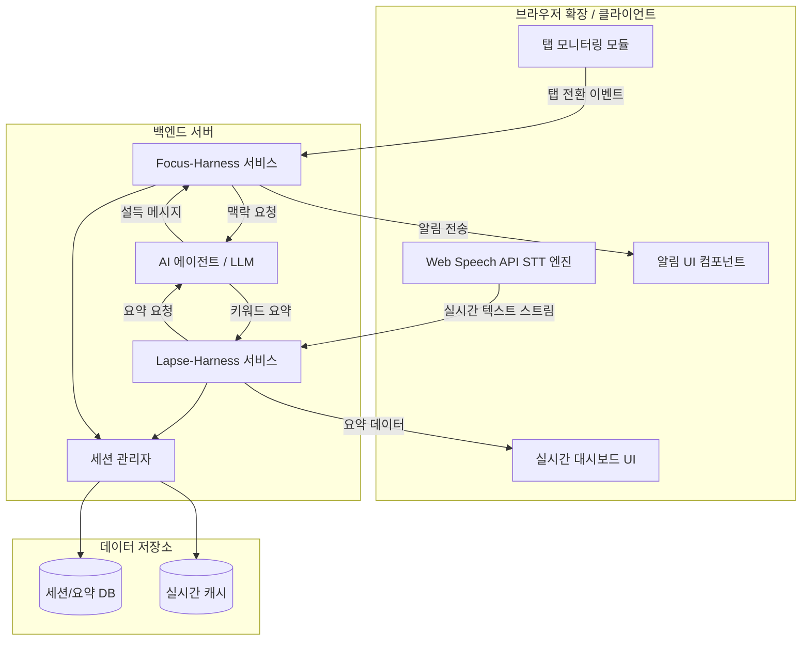
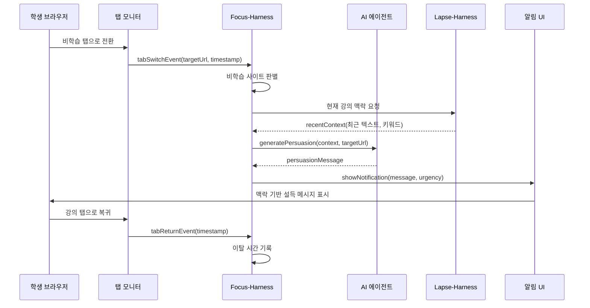
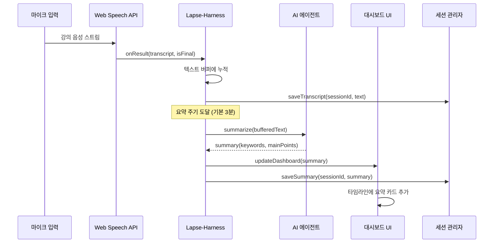

# 설계 문서: ADHD 집중 보조 AI (adhd-focus-assistant)

## 개요

ADHD 대학생의 인지 이탈을 방지하고 실시간 학습을 보조하는 AI 웹 애플리케이션이다. 크게 두 가지 핵심 모듈로 구성된다.

첫째, **Focus-Harness(행동 제어)** 모듈은 학생이 강의 중 유튜브, SNS 등 비학습 탭으로 이동할 때 AI 에이전트가 즉각 개입하여 맥락 기반 설득 메시지를 발송한다. 단순 차단이 아닌, 현재 강의 내용을 기반으로 "지금 교수님이 '중간고사 범위' 말씀 중이에요!"와 같은 맞춤형 알림을 제공한다.

둘째, **Lapse-Harness(정보 보조)** 모듈은 Web Speech API(STT)를 활용해 강의 음성을 실시간 텍스트화하고, AI 에이전트가 일정 주기마다 핵심 키워드를 요약하여 대시보드에 노출한다. 학생이 잠시 멍때리다 정신을 차려도 바로 강의 흐름을 파악할 수 있도록 돕는다.

## 아키텍처



## 시퀀스 다이어그램

### Focus-Harness: 탭 이탈 감지 및 개입 흐름



### Lapse-Harness: 실시간 음성 인식 및 요약 흐름



## 컴포넌트 및 인터페이스

### 컴포넌트 1: TabMonitor (탭 모니터)

**목적**: 브라우저 탭 전환을 감지하고 비학습 사이트 이동 여부를 판별한다.

**인터페이스**:
```pascal
INTERFACE TabMonitor
  PROCEDURE startMonitoring(sessionId: String)
  PROCEDURE stopMonitoring()
  FUNCTION isNonStudySite(url: String): Boolean
  EVENT onTabSwitch(targetUrl: String, timestamp: DateTime)
  EVENT onTabReturn(timestamp: DateTime)
END INTERFACE
```

**책임**:
- 브라우저 visibilitychange, focus/blur 이벤트 감지
- URL 패턴 기반 비학습 사이트 분류 (유튜브, SNS, 게임 등)
- 사용자 정의 허용/차단 목록 관리

### 컴포넌트 2: FocusHarness (행동 제어 서비스)

**목적**: 탭 이탈 시 AI 기반 맥락 설득 메시지를 생성하여 학생을 강의로 복귀시킨다.

**인터페이스**:
```pascal
INTERFACE FocusHarness
  PROCEDURE handleTabSwitch(event: TabSwitchEvent)
  PROCEDURE handleTabReturn(event: TabReturnEvent)
  FUNCTION generatePersuasionMessage(context: LectureContext, targetUrl: String): PersuasionMessage
  FUNCTION getDistractionStats(sessionId: String): DistractionStats
END INTERFACE
```

**책임**:
- 탭 이탈 이벤트 수신 및 처리
- Lapse-Harness로부터 현재 강의 맥락 조회
- AI 에이전트에 설득 메시지 생성 요청
- 이탈 통계 (횟수, 총 이탈 시간) 추적

### 컴포넌트 3: LapseHarness (정보 보조 서비스)

**목적**: 실시간 음성 인식 텍스트를 수집하고 주기적으로 AI 요약을 생성한다.

**인터페이스**:
```pascal
INTERFACE LapseHarness
  PROCEDURE startCapture(sessionId: String)
  PROCEDURE stopCapture()
  FUNCTION getRecentContext(windowSeconds: Integer): LectureContext
  FUNCTION getSummaryHistory(sessionId: String): List OF Summary
  EVENT onSummaryReady(summary: Summary)
END INTERFACE
```

**책임**:
- Web Speech API를 통한 실시간 음성-텍스트 변환 관리
- 텍스트 버퍼 관리 및 주기적 요약 트리거
- 강의 맥락 정보 제공 (Focus-Harness 연동용)
- 요약 이력 저장 및 조회

### 컴포넌트 4: AIAgent (AI 에이전트)

**목적**: LLM을 활용하여 설득 메시지 생성 및 강의 내용 요약을 수행한다.

**인터페이스**:
```pascal
INTERFACE AIAgent
  FUNCTION generatePersuasion(context: LectureContext, distractionTarget: String): String
  FUNCTION summarizeLecture(text: String, previousKeywords: List OF String): Summary
  FUNCTION extractKeywords(text: String): List OF Keyword
END INTERFACE
```

**책임**:
- 강의 맥락 기반 설득 메시지 생성 (단순 경고가 아닌 맞춤형)
- 강의 텍스트 요약 및 핵심 키워드 추출
- 이전 키워드와의 연속성 유지

### 컴포넌트 5: Dashboard (실시간 대시보드)

**목적**: 강의 요약, 키워드, 이탈 통계를 실시간으로 시각화한다.

**인터페이스**:
```pascal
INTERFACE Dashboard
  PROCEDURE renderTimeline(summaries: List OF Summary)
  PROCEDURE addSummaryCard(summary: Summary)
  PROCEDURE updateLiveTranscript(text: String)
  PROCEDURE showDistractionStats(stats: DistractionStats)
END INTERFACE
```

**책임**:
- 타임라인 형태의 요약 카드 표시
- 실시간 텍스트 스트림 표시
- 이탈 통계 시각화 (횟수, 시간)
- 키워드 하이라이트 및 검색

## 데이터 모델

### LectureSession (강의 세션)

```pascal
STRUCTURE LectureSession
  sessionId: UUID
  userId: UUID
  title: String
  startTime: DateTime
  endTime: DateTime OR NULL
  status: ENUM(ACTIVE, PAUSED, COMPLETED)
END STRUCTURE
```

### TranscriptChunk (텍스트 청크)

```pascal
STRUCTURE TranscriptChunk
  chunkId: UUID
  sessionId: UUID
  text: String
  startTime: DateTime
  endTime: DateTime
  isFinal: Boolean
  confidence: Float
END STRUCTURE
```

### Summary (요약)

```pascal
STRUCTURE Summary
  summaryId: UUID
  sessionId: UUID
  periodStart: DateTime
  periodEnd: DateTime
  mainPoints: List OF String
  keywords: List OF Keyword
  rawText: String
END STRUCTURE
```

### Keyword (키워드)

```pascal
STRUCTURE Keyword
  word: String
  frequency: Integer
  importance: Float
  firstMentionedAt: DateTime
END STRUCTURE
```

### DistractionEvent (이탈 이벤트)

```pascal
STRUCTURE DistractionEvent
  eventId: UUID
  sessionId: UUID
  targetUrl: String
  siteName: String
  departureTime: DateTime
  returnTime: DateTime OR NULL
  persuasionMessage: String
  durationSeconds: Integer
END STRUCTURE
```

### DistractionStats (이탈 통계)

```pascal
STRUCTURE DistractionStats
  sessionId: UUID
  totalDistractions: Integer
  totalDistractedSeconds: Integer
  averageDistractionSeconds: Float
  topDistractingSites: List OF SiteCount
  focusRate: Float
END STRUCTURE
```

### PersuasionMessage (설득 메시지)

```pascal
STRUCTURE PersuasionMessage
  message: String
  urgency: ENUM(LOW, MEDIUM, HIGH)
  lectureContext: String
  generatedAt: DateTime
END STRUCTURE
```

**유효성 규칙**:
- `confidence`는 0.0 ~ 1.0 범위
- `focusRate`는 0.0 ~ 1.0 범위 (1.0 = 완벽한 집중)
- `importance`는 0.0 ~ 1.0 범위
- `durationSeconds`는 0 이상
- `sessionId`는 활성 세션을 참조해야 함


## Correctness Properties

*속성(Property)은 시스템의 모든 유효한 실행에서 참이어야 하는 특성 또는 동작이다. 속성은 사람이 읽을 수 있는 명세와 기계가 검증 가능한 정확성 보장 사이의 다리 역할을 한다.*

### Property 1: 세션 생명주기 일관성

*For any* 유효한 userId와 title로 생성된 LectureSession에 대해, 생성 직후 상태는 ACTIVE이고 고유한 sessionId를 가지며, 종료 후 상태는 COMPLETED이고 endTime이 startTime 이후여야 한다.

**Validates: Requirements 1.1, 1.2**

### Property 2: 세션 생성 유효성 검증

*For any* userId 또는 title이 누락된(null 또는 빈 문자열) 입력에 대해, 시스템은 세션 생성을 거부하고 유효성 오류를 반환해야 한다.

**Validates: Requirement 1.4**

### Property 3: 탭 이벤트 필드 완전성

*For any* 탭 전환 또는 탭 복귀 이벤트에 대해, 발생된 이벤트는 대상 URL(전환 시)과 타임스탬프를 포함해야 한다.

**Validates: Requirements 2.1, 2.3**

### Property 4: 비학습 사이트 분류 일관성

*For any* URL에 대해, 허용 목록에 포함된 URL은 비학습 사이트로 분류되지 않아야 하고, 차단 목록에 포함된 URL은 비학습 사이트로 분류되어야 하며, 양쪽 모두에 포함된 URL은 허용 목록이 우선 적용되어야 한다.

**Validates: Requirements 2.2, 3.1, 3.2, 3.3, 3.4**

### Property 5: 이탈 시 맥락 조회 및 설득 메시지 흐름

*For any* 비학습 사이트로의 탭 전환에 대해, FocusHarness는 LapseHarness로부터 강의 맥락을 조회하고, 해당 맥락과 대상 URL을 AIAgent에 전달하여 설득 메시지 생성을 요청해야 한다.

**Validates: Requirements 4.1, 4.2**

### Property 6: PersuasionMessage 필드 완전성

*For any* AIAgent의 설득 메시지 응답에 대해, 생성된 PersuasionMessage는 message, urgency(LOW/MEDIUM/HIGH), lectureContext, generatedAt 필드를 모두 포함해야 한다.

**Validates: Requirement 4.3**

### Property 7: DistractionEvent 기록 완전성

*For any* 이탈-복귀 쌍에 대해, 기록된 DistractionEvent는 대상 URL, 사이트명, 이탈 시각, 복귀 시각, 설득 메시지, 이탈 시간(초)을 모두 포함하며, durationSeconds는 복귀 시각과 이탈 시각의 차이(초)와 일치해야 한다.

**Validates: Requirements 5.2, 5.3**

### Property 8: TranscriptChunk 생성 완전성

*For any* Web Speech API 인식 결과에 대해, 생성된 TranscriptChunk는 텍스트, 시작 시각, 종료 시각, isFinal 여부, confidence 값을 모두 포함해야 한다.

**Validates: Requirement 6.2**

### Property 9: 텍스트 버퍼 누적 정확성

*For any* 순서대로 수신된 텍스트 청크 목록에 대해, 내부 버퍼는 모든 청크의 텍스트를 수신 순서대로 누적해야 하며, 세션 종료 시 남은 버퍼 데이터가 저장되어야 한다.

**Validates: Requirements 6.3, 6.4**

### Property 10: Summary 생성 완전성

*For any* AIAgent의 요약 응답에 대해, 생성된 Summary는 mainPoints와 keywords를 포함해야 하며, 저장 후 조회 시 동일한 데이터가 반환되어야 한다.

**Validates: Requirements 7.2, 7.3**

### Property 11: 시간 범위 기반 맥락 필터링

*For any* 시간 범위(windowSeconds)와 텍스트 청크 집합에 대해, getRecentContext가 반환하는 텍스트와 키워드는 해당 시간 범위 내의 데이터만 포함해야 하며, 범위 내 데이터가 없으면 빈 맥락 객체를 반환해야 한다.

**Validates: Requirements 8.1, 8.2**

### Property 12: 대시보드 상태 반영

*For any* 새로운 Summary 생성에 대해, Dashboard의 타임라인에 해당 요약 카드가 추가되어야 하며, 활성 세션 동안 실시간 텍스트 스트림이 표시되어야 한다.

**Validates: Requirements 9.1, 9.2**

### Property 13: 키워드 검색 정확성

*For any* 키워드 검색 쿼리에 대해, 반환된 결과는 해당 키워드를 포함하는 요약만 포함해야 한다.

**Validates: Requirement 9.4**

### Property 14: 이탈 통계 계산 정확성

*For any* DistractionEvent 목록에 대해, 계산된 DistractionStats의 totalDistractions는 이벤트 수와 일치하고, totalDistractedSeconds는 모든 durationSeconds의 합과 일치하며, focusRate는 0.0에서 1.0 사이의 값이어야 한다.

**Validates: Requirements 10.1, 10.2, 10.3**

### Property 15: 수치 필드 범위 유효성

*For any* 범위 밖의 수치 값(confidence, focusRate, importance에 대해 0.0 미만 또는 1.0 초과, durationSeconds에 대해 0 미만)으로 데이터 생성을 시도하면, 시스템은 해당 생성을 거부해야 한다.

**Validates: Requirements 11.1, 11.2, 11.3, 11.4**

### Property 16: 세션 참조 유효성

*For any* 존재하지 않거나 비활성인 sessionId로 작업을 시도하면, 시스템은 해당 작업을 거부해야 한다.

**Validates: Requirement 11.5**
